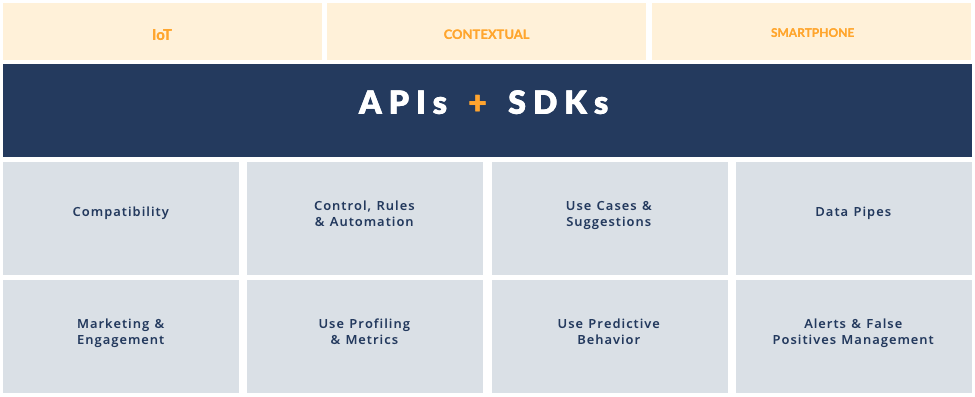

# What is the Habit Analytics Platform?

Habit’s platform provides a full stack of real time data intelligence through our API’s & SDK’s.

## Selfcare Project Management

We offer a [Selfcare](https://selfcare.habit.io) Project Management tool, multi-function management tool that lets you:

* Create your branded mobile app
* View and manage your costumers
* Integrate and manage IoT devices

## Compatibility

We’re focused on bringing into our platform devices that are representative of the ecosystems that you focus on and the markets you operate in.

We’re already compatible with award-winning connected devices, but we can integrate any other IoT device vendors.

If you what to do you own integration, just follow our documentation [here](https://muzzleyintegrations.docs.apiary.io).

## White Label Mobile App or Your custom App

[Build your mobile app](https://selfcare.habit.io/) with us or embed our features into your existing mobile app with our API.

The white label app is open-source and available for [Android](https://github.com/habitio/habit-whitelabel-app-android) and [iOS](https://github.com/habitio/habit-whitelabel-app-ios).

## Mobile SDK & Demo App

HabitAnalytics is an SDK that easily helps you gather analytics information.

It is available for [Android](https://github.com/habitio/habit-android-sdk-sample) and [iOS](https://github.com/habitio/habit-ios-sdk-sample) with a demo app to show how easy it is to integrate it.

